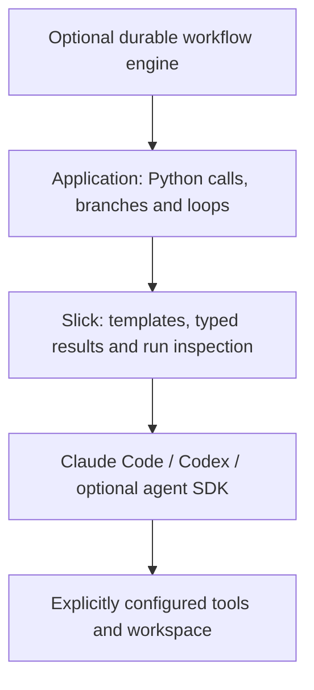

# Agentic workflow libraries through the Slick lens

Research date: 6 September 2026. This is a documentation-based architectural comparison, not a benchmark. Capabilities below are documented; judgments about developer experience and the recommended Slick direction are analysis. Proposed APIs are explicitly labeled.

**Recommendation:** grow Slick around typed calls to capable agent runtimes, with ordinary Python owning the surrounding workflow. Borrow typed contracts, composable capabilities, bounded execution, and observable runs. Keep adopting Slick possible one function at a time.

Slick already implements much of this boundary: `@prompt` renders explicit Jinja templates, validates returned values, repairs invalid responses, and logs/caches responses. Its model layer starts Claude Code or Codex subprocesses. See [README](../README.md), [prompt implementation](../slick/prompts.py), and [execution implementation](../slick/models.py). This checkout declares version 0.2.0 in [pyproject.toml](../pyproject.toml).

**The landscape is about which layer you want a library to own.**

An agent runtime owns the model/tool loop. An orchestrator coordinates calls, state, branches, and handoffs. A durable execution system records progress and resumes work after interruptions. A coding harness supplies an agent with a workspace and execution tools. Products span several layers, so “supports agents” is a poor comparison criterion.

| Library / source | Central abstraction and documented capability | DX tradeoff and lesson for Slick |
| --- | --- | --- |
| [AG2, current design](https://docs.ag2.ai/docs/user-guide/motivation/) | Async agent core with optional harness features; `ask` begins a turn and replies can continue it. | Start small and add capability locally. Its richer runtime still owns tools, history, events, and coordination. |
| [LangGraph](https://docs.langchain.com/oss/python/langgraph/overview) | Stateful orchestration with checkpointing, interrupts, streaming and durable execution. Its [Functional API](https://docs.langchain.com/oss/python/langgraph/functional-api) supports ordinary Python control flow. | Useful when resumption is central. A checkpointer, replay rules and task boundaries are meaningful commitments. Make Slick callable inside this runtime. |
| [CrewAI](https://docs.crewai.com/en/introduction) | Flows coordinate application logic; Crews organize agents, tasks and delegation. [Flows](https://docs.crewai.com/en/concepts/flows) support state persistence. | The team metaphor is convenient for business processes but introduces several concepts. Translate useful patterns into calls and explicit values first. |
| [PydanticAI](https://pydantic.dev/docs/ai/guides/multi-agent-applications/) | Typed agents, delegation, application-controlled handoffs and optional graph composition; [durable backends](https://pydantic.dev/docs/ai/capabilities/durable_execution/overview/) are separate integrations. | Closest conceptual neighbor: types and application code remain prominent. Slick can offer a smaller contract by delegating the inner loop to an existing harness. |
| [OpenAI Agents SDK](https://developers.openai.com/api/docs/guides/agents) | Agent loop, tools, handoffs, sessions, guardrails and traces; supports [agents as tools](https://developers.openai.com/api/docs/guides/agents/orchestration). | Small initial surface, followed by explicit run/session concepts. Borrow the distinction between calling a specialist and transferring conversation ownership. |
| [Microsoft Agent Framework](https://learn.microsoft.com/en-us/agent-framework/overview/) | Successor to Microsoft AutoGen and Semantic Kernel; agents, harness features and workflows. Its [Python Functional Workflow API](https://learn.microsoft.com/en-us/agent-framework/concepts/workflows/functional) is experimental. | Broad integration surface. Ordinary Python workflow syntax is already available here too; Slick must differentiate through reduced lifecycle and configuration burden. |
| [Google ADK 2.0](https://adk.dev/2.0/) | Workflow runtime spanning agents, tools and functions; graph, dynamic and collaborative workflows. [Dynamic workflows](https://adk.dev/graphs/dynamic/) use code and tracked node execution. | Broad application framework. Direct value passing is worth borrowing; taking over application structure should remain optional. |
| [Strands Agents](https://strandsagents.com/docs/user-guide/concepts/multi-agent/multi-agent-patterns/) | Model-driven agents, agents as tools, graphs, swarms and ordinary code composition. | Shows a small entrypoint can coexist with richer coordination. Add only the patterns users repeatedly need. |
| [smolagents](https://huggingface.co/docs/smolagents/index) | Compact agents, including a CodeAgent that writes Python actions; [managed specialists](https://huggingface.co/docs/smolagents/en/examples/multiagents) support delegation. | Attractive short examples. Generated code requires an execution environment; that is a different responsibility from developer-authored Python orchestration. |
| [Claude Agent SDK](https://code.claude.com/docs/en/agent-sdk/overview) / [Codex non-interactive execution](https://learn.chatgpt.com/docs/non-interactive-mode) | Existing agent harnesses exposed programmatically, with workspace execution capabilities. | Most directly adjacent to Slick’s current implementation. Improve access to these capabilities before building another inner agent loop. |

**What the AG2 link actually argues**

The linked page describes a rebuilt, protocol-oriented foundation for AG2 v1.0, rather than just the older `ConversableAgent`/`GroupChat` API. It attributes the redesign to limitations in the inherited architecture and emphasizes a small core with optional capabilities. AG2 and Microsoft’s successor framework are separate projects. [AG2 motivation](https://docs.ag2.ai/docs/user-guide/motivation/)

The concrete starting experience is one agent, a provider configuration, and `await agent.ask(...)`. Adding a decorated Python tool lets the model request it and the runtime execute it. Continuing via the reply preserves conversation context. [AG2 quickstart](https://docs.ag2.ai/docs/user-guide/quick-start/)

Its harness adds context policies, persistent knowledge and delegated subtasks. Agent-as-tool composition is particularly useful: a specialist can be treated as a bounded capability. These are optional runtime features rather than prerequisites for the first agent. [AG2 harness](https://docs.ag2.ai/docs/user-guide/agent_harness/)

For explicit multi-party orchestration, the newer `WorkflowAdapter` uses a `TransitionGraph` to select speakers and termination. Its state can be rebuilt from a write-ahead event log. That is substantial runtime machinery, even when the initial API is concise. [Workflow adapter](https://docs.ag2.ai/docs/user-guide/network/workflow/), [context persistence](https://docs.ag2.ai/docs/user-guide/network/context_variables/)

There are real migration boundaries: the current cookbook marks some patterns partial, including sequential-only fan-out in its redundant workflow example. That limitation belongs to this workflow path; AG2 separately documents parallel agent subtasks. Pin the relevant API generation when evaluating an integration. [Pattern cookbook](https://docs.ag2.ai/docs/user-guide/network/pattern_cookbook/pattern_cookbook/), [harness](https://docs.ag2.ai/docs/user-guide/agent_harness/)

**Agreement, differences and confidence**

These sources converge on tools, specialist composition, explicit state and progressively added runtime capabilities. They differ in who controls sequencing, which state is persisted, and how much application lifecycle the framework owns. Several already offer ordinary Python workflows, so that alone is not a distinctive product claim for Slick.

| Claim / comparison | Evidence type | Caveat | Confidence |
| --- | --- | --- | --- |
| AG2 now emphasizes a small async core and optional harness | Official motivation, quickstart and configuration documentation linked above | Current architecture and classic tutorials coexist | High for documented design |
| Python control flow is available in LangGraph, Microsoft Agent Framework and ADK | Official functional/dynamic workflow guides linked above | Replay/task/context rules still apply; Microsoft functional API is experimental | High for documented availability |
| Frameworks offer different persistence guarantees | LangGraph durable execution docs, CrewAI Flow persistence, PydanticAI backend docs, AG2 workflow docs | Stored conversation or Flow state alone does not prove safe recovery of external effects | High for distinction; no comparative reliability benchmark |
| Typed runtime boundaries are the best fit for Slick | Direct inspection of Slick plus comparison of framework contracts | Product recommendation; depends on users valuing the existing CLI-backed approach | Medium |
| One library produces better answers or lower cost | No controlled experiments performed | Depends on models, prompts, tasks and number of calls | Not established |

**Translate collaboration into existing Python constructs first**

| Agentic pattern | Slick expression | Additional responsibility |
| --- | --- | --- |
| Pipeline | `write(research(question))` | Decide what data each step receives |
| Router | Prompt returns a `Literal`; application branches with `if` | Validate choices and handle failure |
| Critic / revision | Typed review result inside a bounded loop | Define acceptance and fail on exhaustion |
| Specialist delegation | Function calls another function and gets its return value | Isolate specialist inputs and outputs |
| Parallel specialists | Standard Python concurrency, followed by synthesis | Bound concurrency and handle partial failures |
| Shared state / memory | Explicit arguments, dataclasses, or application storage | Select the context sent to each prompt |
| Human review | Application returns a pending decision and continues on a later request | Durable pause/resume needs stored execution state |
| Long-lived workflow | Slick call inside an existing workflow task/activity | External engine owns scheduling and recovery |

A function call is bounded delegation: the caller retains control. A conversational handoff transfers responsibility for subsequent interaction and may transfer history. A full shared conversation has different semantics again. Do not label these interchangeable. [OpenAI orchestration guide](https://developers.openai.com/api/docs/guides/agents/orchestration)

Here is a complete composition example using Slick’s existing API. These docstrings are the templates; no agent/team/graph classes are needed:

```python
from pydantic import BaseModel
from slick import prompt


class Review(BaseModel):
    accepted: bool
    feedback: str


@prompt
def draft(question: str, previous: str = "", feedback: str = "") -> str:
    """Answer {{ question }}.
    Previous draft: {{ previous }}
    Reviewer feedback: {{ feedback }}
    """


@prompt
def review(question: str, answer: str) -> Review:
    """Review whether the answer addresses the question accurately.
    Question: {{ question }}
    Answer: {{ answer }}
    {{ output_format }}
    """


def answer_question(question: str) -> str:
    answer = draft(question)
    for attempt in range(3):
        verdict = review(question, answer)
        if verdict.accepted:
            return answer
        if attempt < 2:
            answer = draft(question, answer, verdict.feedback)
    raise RuntimeError(f"Review limit reached: {verdict.feedback}")
```

This illustrates bounded orchestration, not a claim that a model reviewer establishes factual correctness. Use an external check when acceptance can be determined by tests, a schema, or authoritative data.

For existing applications, these calls can live in an endpoint, worker, script or notebook. For an async application today, `await asyncio.to_thread(answer_question, question)` moves the blocking call off the event loop. Cancellation of that await does not automatically stop an already-running subprocess. Native async process handling would provide a cleaner future contract.

**Three plausible directions for Slick**

1. **Keep the typed prompt core and strengthen harness integration — recommended.** Expose the useful execution capabilities of the existing CLI backends with typed results, explicit workspace access, async execution and observable runs. This preserves the project’s distinctive starting point.
2. **Add an optional AG2 or PydanticAI integration.** Useful when users need model-selected calls into their Python application, dependency injection or conversational state. Begin with an adapter recipe so framework adoption remains local.
3. **Build a general agent/orchestration runtime.** This offers control over everything, but introduces tools, history, scheduling, replay and provider behavior as Slick’s maintenance obligations. There is no evidence from this repository that users need Slick to own all of them.

Integration works in both directions. An AG2 tool can call a Slick function through a small async wrapper. Conversely, a configured AG2 agent can theoretically satisfy Slick’s text-call boundary through an adapter. The latter requires careful async/sync lifecycle and conversation isolation choices; it does not automatically expose AG2 tool events, sessions or persistence through Slick’s current `Model.call` interface. These are integration designs, not existing tested adapters.

A potential later surface could look like this:

```python
# Proposed API only: Slick does not currently export agent.
@agent(template="investigate.md.j2", tools=[search_docs], max_steps=8)
def investigate(question: str) -> Answer:
    ...
```

Here `search_docs` and `Answer` are application-defined. Parameters would still supply template variables and the return annotation would still define the output. The additional contract is that execution may invoke explicitly supplied tools within a bound.

The key engineering decision is how tools cross the process boundary. A Python function in the host process cannot simply become available inside `codex exec` or `claude -p`. Reusing the harness’s supported tool bridge, such as MCP where appropriate, or adopting an in-process agent SDK is necessary. Codex documents MCP configuration; Claude’s SDK exposes programmatic agent capabilities. [Codex MCP](https://learn.chatgpt.com/docs/extend/mcp?surface=cli), [Claude Agent SDK](https://code.claude.com/docs/en/agent-sdk/overview)

Do not implement a second planner/tool loop around an existing agent harness without a concrete need. Let one layer own that loop. Keep any new agent execution non-cached by default when it observes mutable state or performs actions.

The recommended division of responsibility is:



Slick's rendered prompt is the text it submits to the backend. An underlying harness may add its own instructions, configuration or workspace context; exposing the submitted text does not establish full visibility into the backend's effective context.

**What I would prioritize**

First, publish a small cookbook of working pipelines, routing and review loops with the current API. This makes the existing capability visible without adding abstractions.

Next, strengthen the execution boundary: native async calls, cancellation, consistent workspace/permission semantics, preserved provider events, and a run record that connects nested calls. Return ordinary typed values by default; make inspection optional.

The current code makes these gaps concrete: execution uses blocking `subprocess.run`; the public prompt wrapper has no native async path; model execution returns final text and a transcript rather than a live event iterator; and the Claude command builder currently ignores the common `sandbox` argument. Codex’s builder uses it. A future uniform execution interface must handle that difference explicitly. These are code observations, not changes made by this report.

Also separate result reuse from execution history. Today’s content-addressed logs are useful for prompt caching, but repeated identical calls share a directory. They do not constitute a complete chronological record of workflow attempts or a durable scheduler. Cached results also cannot account for external state that was never included in the prompt key. [Prompt implementation](../slick/prompts.py)

Then add a single tool-capable function abstraction only if application examples require it. Prefer one explicit tool list and bounded execution to a new collection of team, role, task and manager objects. Keep framework-specific adapters optional.

When users need recovery across worker restarts or approvals lasting days, put Slick calls inside an established durable runtime. Checkpointing a response and safely retrying an external action are different responsibilities; the action still needs appropriate idempotency and transaction semantics. [LangGraph functional execution](https://docs.langchain.com/oss/python/langgraph/functional-api), [PydanticAI durable execution](https://pydantic.dev/docs/ai/capabilities/durable_execution/overview/)

A useful product promise would be: **“Agent capabilities as typed Python functions. Call them from the code you already have.”** Success means the first useful workflow requires only Slick’s decorator and familiar Python, while more demanding integrations have an explicit path.

Validation: both Python examples parse. The existing-API example was exercised against Slick using a fake backend through rejection, revision and acceptance (four calls). No live model calls or framework integration tests were run.

## Sources

- [AG2 motivation](https://docs.ag2.ai/docs/user-guide/motivation/)
- [AG2 quickstart](https://docs.ag2.ai/docs/user-guide/quick-start/)
- [AG2 harness](https://docs.ag2.ai/docs/user-guide/agent_harness/)
- [AG2 workflow adapter](https://docs.ag2.ai/docs/user-guide/network/workflow/)
- [AG2 workflow context variables](https://docs.ag2.ai/docs/user-guide/network/context_variables/)
- [AG2 pattern cookbook](https://docs.ag2.ai/docs/user-guide/network/pattern_cookbook/pattern_cookbook/)
- [LangGraph overview](https://docs.langchain.com/oss/python/langgraph/overview)
- [LangGraph Functional API](https://docs.langchain.com/oss/python/langgraph/functional-api)
- [CrewAI introduction](https://docs.crewai.com/en/introduction)
- [CrewAI Flows](https://docs.crewai.com/en/concepts/flows)
- [PydanticAI multi-agent applications](https://pydantic.dev/docs/ai/guides/multi-agent-applications/)
- [PydanticAI durable execution](https://pydantic.dev/docs/ai/capabilities/durable_execution/overview/)
- [OpenAI Agents SDK](https://developers.openai.com/api/docs/guides/agents)
- [OpenAI orchestration and handoffs](https://developers.openai.com/api/docs/guides/agents/orchestration)
- [Microsoft Agent Framework overview](https://learn.microsoft.com/en-us/agent-framework/overview/)
- [Microsoft Functional Workflow API](https://learn.microsoft.com/en-us/agent-framework/concepts/workflows/functional)
- [Google ADK 2.0](https://adk.dev/2.0/)
- [Google ADK dynamic workflows](https://adk.dev/graphs/dynamic/)
- [Strands multi-agent patterns](https://strandsagents.com/docs/user-guide/concepts/multi-agent/multi-agent-patterns/)
- [smolagents introduction](https://huggingface.co/docs/smolagents/index)
- [smolagents multi-agent example](https://huggingface.co/docs/smolagents/en/examples/multiagents)
- [Claude Agent SDK](https://code.claude.com/docs/en/agent-sdk/overview)
- [Codex non-interactive execution](https://learn.chatgpt.com/docs/non-interactive-mode)
- [Codex MCP](https://learn.chatgpt.com/docs/extend/mcp?surface=cli)
- Local implementation: [README](../README.md), [prompts](../slick/prompts.py), [models](../slick/models.py), [package metadata](../pyproject.toml)
