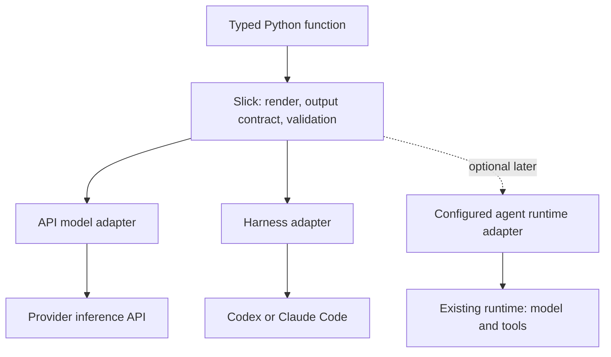

# API models and agent harnesses in Slick

Research date: 6 September 2026. This extends the [agentic workflow landscape](agentic-workflow-landscape-comparison.md). It is an architectural investigation using primary documentation and the current checkout, not an implemented interface or a live-provider benchmark.

**Recommendation: one typed-function experience, explicit execution choices.** Support direct API models and agent harnesses through sibling adapters. Share template rendering, output contracts, local validation, and run inspection. Let each adapter retain responsibility for its execution semantics.

The user's accepted direction is the product constraint: agent-enabled code should feel like normal Python and integrate with existing application code. Slick should remain small and adoptable one function at a time.

**Separate model inference, agent execution, and transport**

A model generates a response from supplied input. A response can contain text, structured data or a request to call a tool. A tool-call request is not the execution of that tool: the documented OpenAI function-calling flow returns the request to the application, which executes code and supplies the result in another request. [OpenAI function calling](https://developers.openai.com/api/docs/guides/function-calling)

An agent combines a model with tools, context and a policy/loop for continuing work. A harness supplies that execution machinery: tool dispatch, state/context management, limits, events, and potentially a workspace. Claude's Agent SDK explicitly exposes the loop and tools that power Claude Code. [Claude Agent SDK](https://code.claude.com/docs/en/agent-sdk/overview)

An API or CLI is how work is submitted. Either can expose agent execution. For example, Anthropic server tools can run multiple searches or code executions within one API request. Therefore, “one HTTP request” is not a reliable definition of “one inference step.” [Anthropic tool execution](https://platform.claude.com/docs/en/agents-and-tools/tool-use/how-tool-use-works)

| Execution kind | Who owns the continuation loop? | Access and state | Slick contract |
| --- | --- | --- | --- |
| Direct API inference, with no tools enabled | No application tool loop; adapter obtains a completed model response | Input explicitly supplied by the application; keep cross-call history opt-in | Return a validated value or a meaningful failure |
| API with client-executed tools | Agent runtime or SDK tool runner | Explicit callable tools and turn history | A separately configured agent backend owns continuation and tool execution |
| API with server-executed tools | Provider, subject to endpoint semantics | Provider tool environment and explicitly requested capabilities | Preserve tool/provenance metadata and distinguish completion from a paused response |
| CLI or SDK harness | Harness | Configured workspace, tools, instructions and session state | Delegate work, observe completion, validate final output |

This reconciles the concepts without treating a model as an agent or assuming API calls are always passive.

**The current Model class combines two responsibilities**

In [models.py](../slick/models.py), `Model` requires a subprocess command, owns subprocess execution, and implements `call` through `execute(..., sandbox="read-only")`. `ClaudeModel` and `CodexModel` name harness adapters as models. The common caller is small, but the superclass is specific to CLI execution.

The [prompt wrapper](../slick/prompts.py) already accepts duck-typed stand-ins with `call`, `backend` and `model`. A simple API adapter could use that path immediately. However, that string-only boundary cannot convey native output schemas, completion status, usage, response identifiers or structured tool requests. Making an API adapter subclass a shell executor would carry the wrong assumptions forward.

The smallest coherent evolution is a small shared backend request/result boundary with independent API and harness implementations. There is no need for a capability registry, plugin manager, universal conversation model or orchestration DSL.

Conceptually:

```text
Backend request:
    rendered prompt
    optional output schema

Backend response:
    final output
    completion status
    optional usage and provider metadata
```

Provider model IDs, credentials/client, inference settings, and harness workdir/session/permissions belong to the configured adapter. Start with only the fields demanded by the initial integrations. Preserve native response metadata as an escape hatch, while callers receive their annotated Python type.



**One decorator can preserve the current mental model**

I recommend keeping one primary function decorator initially and making the execution choice explicit. This is a proposed naming sketch; none of these new adapters or the `backend=` argument exist yet:

```python
# Proposed Slick API; model IDs, templates and return types are app-defined.
from slick import prompt
from slick.backends import OpenAIModel, Codex

llm = OpenAIModel(model="YOUR_MODEL_ID")
repo_agent = Codex(workdir=".", sandbox="read-only")

@prompt(backend=llm, template="summarize.md.j2")
def summarize(text: str) -> Summary:
    ...

@prompt(
    backend=repo_agent,
    template="inspect_repo.md.j2",
    cache=False,
)
def inspect_repo(question: str) -> Findings:
    ...

findings = inspect_repo("Where is authentication enforced?")
summary = summarize(findings.description)
```

The caller sees functions and returned values. The declaration reveals whether the work uses an API model or a configured harness. An API model would have no local tools by default; configuring a tool loop creates agent execution explicitly. A future `@agent` convenience decorator could clarify declarations if examples justify it, but it need not create a second function system.

Alternatives considered:

| Surface | Benefit | Cost | Recommendation |
| --- | --- | --- | --- |
| One `@prompt`, explicit backend objects | Closest to current usage; all backends compose identically | “Prompt” also covers delegation to a harness | Start here |
| `@prompt` and `@agent`, shared internals | Declaration advertises inference vs delegated work | Extra concept and migration question for existing CLI-backed prompts | Consider after testing documentation/examples |
| One string that implicitly selects model, tools, runtime and permissions | Short first example | Hides operational changes behind model selection | Avoid implicit escalation of capabilities |

Keep the current `model="codex"` / `model="claude"` behavior working through compatibility aliases while any clearer naming is introduced. Do not silently reinterpret `claude` as Anthropic API access. Model IDs should be scoped to their provider/runtime instead of one process-global ID being reused across unrelated backends.

Swapping backends preserves the Python result contract only when the new backend supports the declared operation. It does not promise identical answers, tools, context or permissions. Reject unsupported requested capabilities instead of dropping them.

**Structured outputs can unify the result boundary**

OpenAI and Anthropic document native schema-based output. Slick can derive a schema from the return annotation, pass it to an adapter, and validate the returned data locally. Provider-supported JSON Schema is a subset of what Pydantic can express, so local validation remains authoritative. [OpenAI structured outputs](https://developers.openai.com/api/docs/guides/structured-outputs), [Anthropic structured outputs](https://platform.claude.com/docs/en/build-with-claude/structured-outputs)

There is also a correction to the repository's current documentation: it says CLI-backed models lack constrained decoding and relies on prompt-level schemas. Current Codex documents `--output-schema`; Claude Code documents `--json-schema` with JSON output. These establish schema-output interfaces, not a guarantee that every backend uses identical decoding internals or supports every constraint. Slick currently uses neither interface. [Codex schema output](https://learn.chatgpt.com/docs/non-interactive-mode), [Claude Code schema output](https://code.claude.com/docs/en/headless)

Consequences for the shared implementation:

- Carry the output contract separately from the prompt text, allowing adapters to use native schema support.
- Preserve existing templates and the meaning of `{{ output_format }}`; do not silently remove template text. A compatibility phase can keep existing schema instructions while also passing a native schema.
- Log the submitted text plus the relevant schema and non-secret request settings. `.render()` alone cannot describe a structured API request.
- Keep support for `list[Item]`, `Literal`, scalars and dataclasses. Where the provider requires a root object, an adapter can wrap a value as `{"value": ...}` and unwrap it before validating against the original annotation. OpenAI documents a root-object restriction.
- Treat refusals and incomplete responses as distinct failures, not automatically as malformed JSON to repair.
- If native enforcement cannot represent a contract, use a documented fallback policy or raise; retain local validation in either case.

One successful Python call promises an accepted typed value. It need not promise one billable request: transport retries, schema repair, hosted tools and agent execution can each add work. Run inspection should make that work visible.

**Choose the API foundation to match actual scope**

| Foundation / source | Documented capability | Tradeoff for Slick | Evidence / confidence |
| --- | --- | --- | --- |
| Official provider SDKs: [Anthropic SDK](https://platform.claude.com/docs/en/cli-sdks-libraries/sdks/python), [OpenAI SDK docs](https://developers.openai.com/api/docs/libraries) | Native clients and provider-specific request/response surfaces; parsing support through the providers' structured-output APIs | Fewest additional abstractions for an initial OpenAI/Anthropic scope; Slick maintains provider adapters | Official docs; high for capabilities, medium for best-fit judgment |
| [LiteLLM](https://docs.litellm.ai/docs/) | Unified provider calls; [structured-output support and checks](https://docs.litellm.ai/docs/completion/json_mode) | Broad coverage quickly, with an additional translation/dependency layer. SDK use does not require deploying its proxy | Official docs; high |
| [PydanticAI direct model API](https://pydantic.dev/docs/ai/core-concepts/direct/) | Model requests, schema translation, sync/async and streaming without requiring an Agent | Credible optional normalization foundation. Direct requests return tool-call parts without executing them | Official docs; high |
| [Instructor](https://python.useinstructor.com/integrations/openai/) | Typed extraction, validation and retries; [raw completion access](https://python.useinstructor.com/integrations/litellm/) | Overlaps Slick's existing validation and repair ownership; best if extraction is the main missing capability | Official docs; high |

Start with optional official SDK adapters for OpenAI and Anthropic. Keep the base install small and import SDK dependencies only for the selected backend. Reuse or accept a configured provider client to support connection reuse and application-owned credentials/lifecycle.

If broad provider support is needed immediately, PydanticAI's direct API and LiteLLM deserve a small adapter spike. PydanticAI is attractive for typed model semantics; LiteLLM is attractive for provider breadth and existing gateways. Neither requires adopting its full agent/application architecture. Instructor is useful but offers less distinct value while Slick already owns parsing and validation retries.

This investigation establishes documented fit, not measured installation size, latency or dependency compatibility. A release-pinned installation check should accompany implementation; main-branch package metadata is not a substitute for that check.

**Execution differences that should remain explicit**

| Concern | Model inference | Harness / agent execution |
| --- | --- | --- |
| Retries | SDK transport retry and bounded output repair | Runtime may already retry; rerunning a task can repeat actions |
| Cache | Optional result reuse for explicitly supplied inputs | Disable by default for live workspace/tool execution unless complete input state is captured |
| State | No automatic history shared between function calls | Fresh run by default; continue only with explicit session configuration |
| Cancellation | Cancel/close the local request; remote behavior depends on API | Stop or interrupt the actual runtime, including owned subprocesses where supported |
| Limits | Request timeout and output budget | Also runtime/tool/turn bounds where supported |
| Metadata | Status, usage and response ID | Also runtime events, tool activity and session ID when exposed |

The current `_digest` hashes prompt, backend name and model ID. Native schemas, endpoint identity and output-affecting settings need to participate in an API cache identity; credentials should not. Applications also need cache separation for tenant-sensitive contexts. This is a direct implementation implication, not a reason to create a general caching framework.

Output repair deserves special care for harnesses. Current `_run` repeats `model.call` with the original prompt and a repair appendix. With effectful agent work, that can repeat the task. Prefer repairing only the final representation from captured output, or fail with a typed validation error. Do not silently rerun the operational task just to obtain valid JSON.

Async support should preserve familiar Python: an `async def` declaration should be awaited, and a sync function should remain directly callable. Avoid a wrapper that sometimes returns a value and sometimes a coroutine depending on whether an event loop is running. Scope client and subprocess lifetimes clearly.

**A focused implementation sequence**

1. Introduce a schema-aware backend boundary while retaining current function behavior and legacy model aliases.
2. Add optional OpenAI and Anthropic model adapters, native structured output, explicit completion/failure handling and sync/async behavior.
3. Update CLI adapters to pass output schemas through their supported interfaces and preserve meaningful response metadata.
4. Make inference repairs and agent-task retries separate policies; align cache behavior with execution effects.
5. Demonstrate one mixed application: API extraction, harness investigation, ordinary Python checks, API summarization. Add runtime/tool integrations only when a real example requires them.

The enduring abstraction is the typed function. API inference and delegated agent work are different implementations of completing that function's declared job, with explicit configuration describing the authority and execution behavior behind it.

Validation: local interfaces were inspected; provider behavior was checked against official documentation. No runtime code was modified, SDKs installed, or live model requests made.

## Sources

- [OpenAI function calling](https://developers.openai.com/api/docs/guides/function-calling)
- [OpenAI structured outputs](https://developers.openai.com/api/docs/guides/structured-outputs)
- [OpenAI SDK libraries](https://developers.openai.com/api/docs/libraries)
- [Anthropic tool execution](https://platform.claude.com/docs/en/agents-and-tools/tool-use/how-tool-use-works)
- [Anthropic structured outputs](https://platform.claude.com/docs/en/build-with-claude/structured-outputs)
- [Anthropic Python SDK](https://platform.claude.com/docs/en/cli-sdks-libraries/sdks/python)
- [Claude Agent SDK](https://code.claude.com/docs/en/agent-sdk/overview)
- [Claude Code programmatic execution](https://code.claude.com/docs/en/headless)
- [Codex non-interactive execution](https://learn.chatgpt.com/docs/non-interactive-mode)
- [LiteLLM](https://docs.litellm.ai/docs/)
- [LiteLLM structured outputs](https://docs.litellm.ai/docs/completion/json_mode)
- [PydanticAI direct requests](https://pydantic.dev/docs/ai/core-concepts/direct/)
- [Instructor OpenAI integration](https://python.useinstructor.com/integrations/openai/)
- [Instructor raw completion access](https://python.useinstructor.com/integrations/litellm/)
- Local: [models](../slick/models.py), [prompts](../slick/prompts.py), [README](../README.md), [package metadata](../pyproject.toml)

